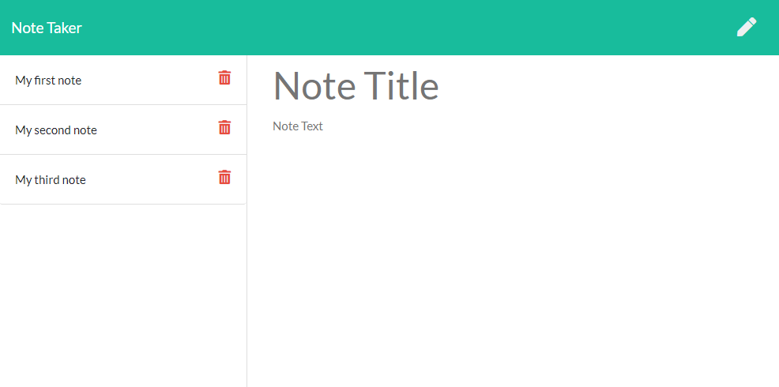

# Bootcamp Homework 11 - Express: Note Taker

## Description
This is a coding bootcamp homework assignment to create an application that can be used to write, save, and delete notes.  The application uses an express backend and retrieves notes data from a JSON file.  The application is deployed on Heroku.   

## Table of Contents
* [Usage](#Usage)
* [Demo](#Demo)
* [Contributing](#Contributing)
* [Questions](#Questions)
* [License](#License)

## Usage
The [Note Taker](https://radiant-cliffs-46495.herokuapp.com/) application runs in the browser.

Click on the "Get Started" button to go to the add/saved notes screen:

Enter text in the Note Title and Note Text fields and then save to create a Notes List.  Notes can then be deleted when no longer needed:

## Demo

## Contributing
Fork the repo and submit a pull request to enhance the code or fix a bug
## Questions
Have questions?  Contact me on [GitHub](https://github.com/thorgriffs) or email <22.kelliking@gmail.com>
## License

  [MIT](https://github.com/thorgriffs/note-taker/blob/main/LICENSE) License
  
  Copyright (c) 2021 Kelli King